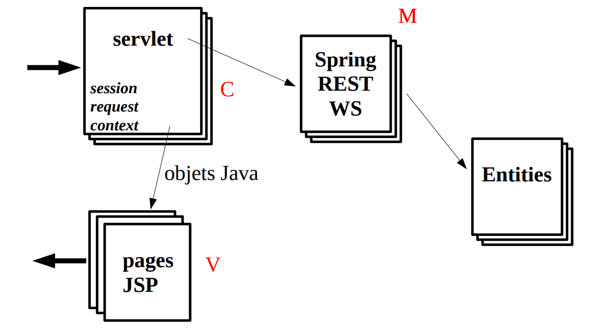

# Projet Applications Web

## Daniel Hagimont

## Camelia Slimani

## Boris Teabe

---

## Rappel: MVC

---

## Technologies additionnelles

- Styles : CSS / LESS / Bootstrap
- JavaScript : scriptaculous, Jquery, AngularJS, React ...
- Services techniques : transactions, sécurité …
- Client non web
- …
- Mais Spring/JPA

---

## Objectif du projet

- Aller plus loin que les TP
- Implanter une application web dynamique réaliste
  - degré de complexité $\Leftrightarrow$ nombre d'entités (au moins 7)
- Découvrir par vous même des aspects non détaillés en cours
- Travailler en groupe

---

## Eléments d'évaluation

- Ambition du projet
- Structuration du code
- Découverte de technologies
- Avancement régulier
- Répartition des tâches
- Gestion de projet

---

## Déroulement du projet (1/3)

- Groupes
  - En quadrinome (sauf exception)
  - Pas de contrainte dans les groupes A/B/L12/L34/M
  - Deadline composition groupe : 11/03/2025 (midi)
    - Pas de nouvelles : ABI
- Séances de suivi
  - Assistance d'un intervenant
- Comptes rendus obligatoires chaque semaine (email)
  - La veille du suivi (4 séances)
    - 21/03, 1-2-3/04, 6-7/05, 20-22/05, 3-4-5/06
  - Rappeler les réalisations de chaque semaine
    - Configuration d'outils
    - Lines of code
  - Prise en compte dans l'évaluation

---

## Déroulement du projet (2/3)

- Première séance de suivi
  - Définition du site
  - Documents présentant :
    - Thème de site (réaliste)
    - Spécifications : fonctionnalités, enchaînement des pages,
schéma de données (spec grossière, mais au propre)
    - (Environnement configuré)
  - Retour d'un enseignant sur le document (par email)
- Séances suivantes
  - Blog d'avancement (format email/text), quelques lignes ajoutées à chaque étape
  - Historique d'avancement

---

## Déroulement du projet (3/3)

- Evaluation du projet
  - Présentation :
    - 5mn présentations (slides)
    - 5mn démo
    - 5mn questions
    - Projection dans une salle de TP (à préparer)
  - A la suite de votre présentation :
    - Envoyer une archive
      - Code source (enlever les binaires (code, images …))
      - Rapport succinct

---

## Rappel des dates

- 11/03/2025 (midi / deadline groupes) +4
- 21/03/2025 (1er suivi / spécifications) +14
- 1-2-3/04/2025 (suivi) +11
- 6-7/05/2025 (suivi) +35 (vacances)
- 20-22/05/2025 (suivi) +14
- 3-4-5/06/2026 (présentations) +14

---

## Conseils

- Faire un environnement propre de développement (vscode, Tomcat, Spring, svn/git ...)
- Faire marcher un exemple de bout en bout avec les briques technologiques (maquette, comme pour le TP)
- Faire une spécification propre du site (schémas) – doc à rendre
- Travaillez (et debuggez) par incréments (et sauvegardes)
- Vous êtes 4, il y a une raison, répartissez vous les tâches
- Utiliser des techniques collaboratives (skype, visio ...)

---

## Prochaine étape

- Deadline : 11/03/2025 midi
  - mail notifiant la constitution d'un groupe
  - Si vous ne trouvez pas de groupe, envoyer un mail
  - Pas de nouvelle : ABI
- Premier suivi (21/03/2025)
  - Une proposition de projet avec un document de spécifications
  - Environnement configuré

---

## Correspondance : <daniel.hagimont@irit.fr>

- Pour toute correspondance
  - Titre du mail :
    - JEE : dupont-durant-dumont-dumas
- Constitution du groupe
  - {Prénom Nom – groupe}
  - Exemple :
    - Alain Dupont – groupe L1
    - David Durant – groupe L2
- Compte-rendu (format email/texte)
  - Un blog rappelant toutes les étapes depuis le début
  - Exemple :
    - Séance 1 :
      - Thème du site : gestion d'un club sportif
      - Spécifications du site
    - Séance 2 :
      - Définition des entity : classes x, y, z (330 LOC)

---

## Thème de votre projet

- Pour éviter d'avoir tout le temps les mêmes projets, cette année, je vous impose un thème général :
- Gestion d'une association ou un club
- Exemples de fonctionnalités
  - Gestion des adhérents
  - Calendrier d'événements
  - Email aux adhérents
  - Forum de discussion
  - Cotisations
